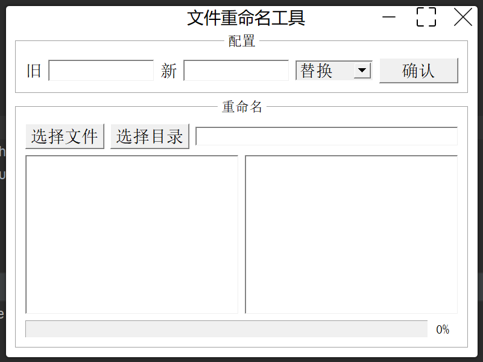
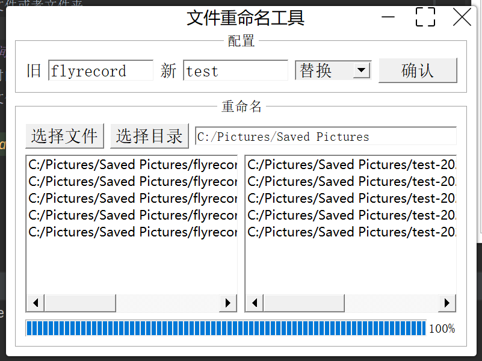
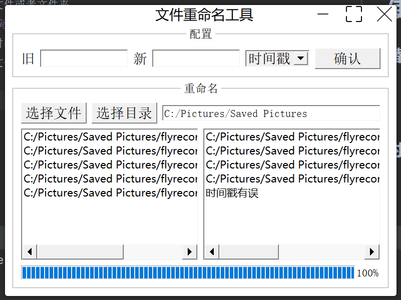

# 文件重命名工具

## 环境
- Clion 2022.1.2
- qt 5.14.2

## 功能
- 单个文件重命名
- 文件夹多个文件重命名

## 模式
### 替换模式
> 将文件名中的旧字符串替换为新字符串

旧字符串为空时，将文件名设置为新字符串

新字符串不能存在为：/\<>?*|

新字符串不能为空

### 时间戳模式

> 将文件名中的UTC时间戳替换为北京时间:年月日时分秒

旧文件名用“-”连接,为：前段名-UTC时间戳.后缀 格式

程序会将UTC时间戳替换为北京时间年月日时分秒格式

新名：前段名-北京时间.后缀

## 重复文件处理
当前文件夹有重复文件时，在新名后加“-旧名”字符串

## 使用
deploy目录下为生成的程序，可以直接使用
### 替换模式
- 输入新旧字符串，选择替换模式，点击确认
- 选择文件或者文件夹

### 时间戳模式
- 选择时间戳模式，点击确认
- 选择文件或者文件夹

## 更改日志
### 20220620 v1.0.1
- [x] 新增打开文件目录功能（右下角listwidget支持）
- [x] 新增删除文件功能（右下角listwidget支持）

